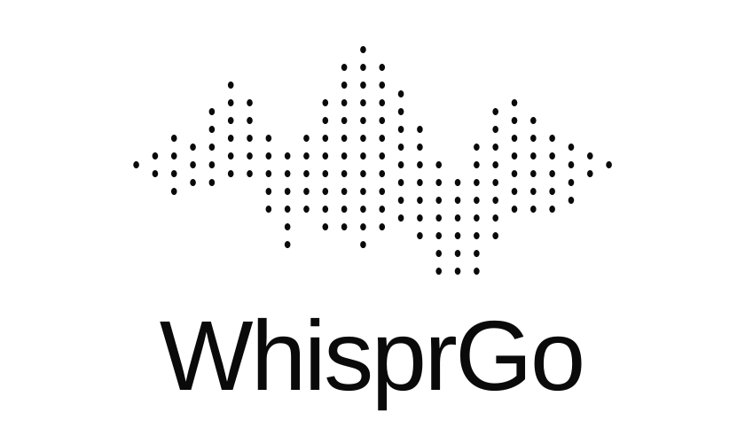

<p align="center">
  
</p>

WhisprGo is a low-latency macOS dictation engine that lives in the menu bar. Hold **fn** for push-to-talk, then release it to type. Press **fn + shift** once to start hands-free listening and press the chord again to stop and type.

## What is included

- A native SwiftUI menu-bar interface and Settings window.
- Hold **fn** for push-to-talk, or toggle dictation with **fn + shift**.
- Automatic one-time download and warm-up for Parakeet and Whisper models.
- NVIDIA Parakeet TDT 0.6B v3 plus local Whisper Tiny, Base, Small, and Large v3 Turbo choices.
- OpenAI `gpt-transcribe`, `gpt-4o-mini-transcribe`, and `whisper-1` choices.
- API keys stored in macOS Keychain.
- AirPods mode uses the built-in Mac microphone while leaving headphones in high-quality playback mode.
- Optional always-active input for the lowest possible shortcut-to-audio latency.
- Optional launch at login.
- No audio or transcript history.

The default is NVIDIA Parakeet TDT 0.6B v3, running locally through Core ML. It automatically detects and transcribes 25 European languages. Select Whisper Tiny for the smallest resident footprint, or an API model to avoid holding a local model in RAM.

Downloaded models can be removed in **Settings → Models**. Select a different model first, then click the clearly labeled **Remove** button beside the downloaded model and confirm. Choosing a removed model later downloads it again automatically.

## Requirements

- macOS 14 or newer
- Apple silicon for practical local-model performance
- Xcode 26 / Swift 6.2 or newer

## Install

Download the latest `WhisprGo-macOS.zip` from [Releases](https://github.com/Lxvi101/WhisprGo/releases/latest), unzip it, and move **WhisprGo.app** to Applications.

Version 1.0 is ad-hoc signed while Developer ID distribution is being set up. On first launch, Control-click the app, choose **Open**, then confirm. macOS will ask for Microphone and Accessibility access.

## Build

From the project folder:

```sh
zsh Scripts/build-app.sh
```

The packaged app is created at:

```text
.build/WhisprGo.app
```

Open it from Finder or run:

```sh
open '.build/WhisprGo.app'
```

On first launch, allow Microphone and Accessibility access. Accessibility is required for the global shortcut and for inserting text at the active cursor.

## Performance shape

WhisprGo removes avoidable wake-up latency rather than promising impossible zero-time inference:

- The global event tap watches only modifier changes.
- The AVAudioEngine graph, converter, and output buffer are reused between dictations.
- Microphone packets are resampled from their actual delivered frame count; a preallocated worst-case buffer avoids both truncation and render-thread allocation.
- AirPods mode is on by default and pins this app's input to the built-in Mac microphone without changing the output device.
- By default, the microphone graph and input tap are fully released while idle.
- An explicit “Keep microphone active” setting leaves the hardware stream running for instant response. A lock-free gate exits the callback before conversion, metering, locks, or buffer writes while idle.
- The audio render callback writes its latest level to one relaxed atomic value; it never queues UI work.
- The recording indicator is a layer-backed AppKit pill synchronized to the display, with no SwiftUI invalidation, Combine publishing, implicit layer animation, or text layout in its recording path.
- Audio buffers are handed to inference without a full-array copy and modest buffers are reused between dictations.
- Download progress is coalesced before it reaches the settings UI.
- Silence is rejected before model inference.
- Incomplete or failed microphone conversion is rejected before inference instead of producing a plausible but unrelated transcript.
- Only the selected local model is resident in memory.
- Local inference uses Core ML and Apple Neural Engine defaults.
- Cloud dictation reuses a single ephemeral URLSession connection pool.
- Text insertion tries the focused Accessibility element before falling back to Unicode key events.

See [Architecture](docs/ARCHITECTURE.md) for the full lifecycle and tradeoffs.

## Privacy

Local model audio never leaves the Mac. OpenAI model audio is uploaded only after a dictation ends—when fn is released or the toggle is stopped. API keys are stored in Keychain. WhisprGo does not save audio or transcripts. If always-active input is enabled, idle samples are discarded immediately and never enter a recording buffer.

## Acknowledgements

The interaction and lean native architecture were inspired by [digimata/parrot](https://github.com/digimata/parrot). Parakeet inference is provided by [FluidAudio](https://github.com/FluidInference/FluidAudio), and Whisper inference by [Argmax's open-source WhisperKit SDK](https://github.com/argmaxinc/argmax-oss-swift).
